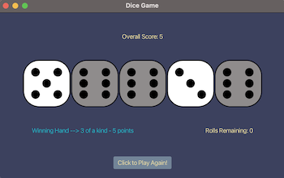

## dice_game

## Description

A poker style game with Dice.

## Screenshot

## Installation and Execution

1. Requirements

   - Java 17
     - https://www.oracle.com/java/technologies/javase/jdk17-archive-downloads.html
   - JavaFx 21
     - https://openjfx.io/
   - Maven 3.9.5
     - https://maven.apache.org/download.cgi

2. Clone repository

3. Compile project with maven

   - Note: may need to update paths in `pom.xml` to user installed paths
   - mvn clean install

4. Execute:
   - java --module-path {path_to_javafx_lib} --add-modules javafx.controls,javafx.fxml -jar target/jar-output/dice_game-1.0.0.jar
